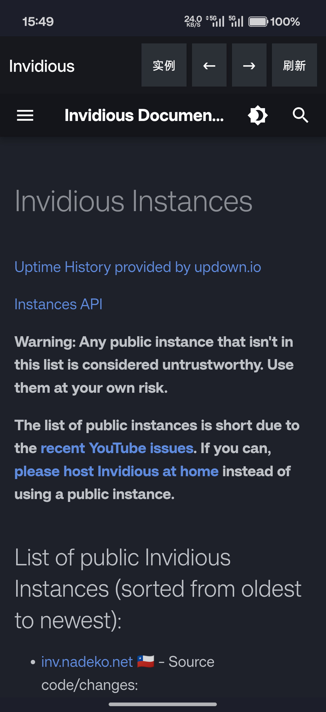

# Invidious WebView Android

一个**极简的 Invidious 安卓客户端**：用系统 WebView 加载任意 Invidious 实例，不依赖任何第三方库。

配套提供 **Invidious 本地部署** 的 `docker-compose.yml` 与一键启动脚本。

> 重要事实：Invidious 本身是用 Crystal 写的**服务器端**程序（YouTube 隐私前端），官方只提供 Docker / 源码两种部署方式，**没有官方安卓 APK**。因此"上手机"的只能是连接 Invidious 服务端的客户端——本项目就是这个客户端。

---

## 1. 项目结构

```
invidious-webview-android/
├── app/                      # 安卓壳 App（纯 WebView，Java）
│   └── src/main/java/app/invidious/webview/MainActivity.java
├── docker-compose.yml        # 本地部署 Invidious（invidious + postgres）
├── start-invidious.sh/.bat   # 一键启动脚本
├── settings.gradle / build.gradle / gradle.properties
├── gradle/wrapper/           # 复用本机已有 Gradle 8.13 wrapper
└── local.properties          # sdk.dir 指向本机 Android SDK
```

---

## 2. 构建 APK（用本机现有安卓环境）

本机已有：JDK 17（Temurin）、Android SDK（platform-tools / build-tools 35·36 / platforms 35·36）、Gradle 8.13。

```bash
# 1) 确保 local.properties 里 sdk.dir 指向你的 Android SDK
#    （本仓库已默认填 D:/WorkBuddy_3DGS/.android-sdk）

# 2) 构建 debug 包
./gradlew assembleDebug

# 3) 产物路径
app/build/outputs/apk/debug/app-debug.apk
```

> 首次构建会自动下载 Gradle 8.13 与 Android Gradle Plugin 8.13.0，需要联网（maven.google.com / gradle plugin portal），耗时几分钟。

---

## 3. 装机测试

```bash
# 用本机 SDK 的 adb 安装
D:/WorkBuddy_3DGS/.android-sdk/platform-tools/adb.exe install -r app/build/outputs/apk/debug/app-debug.apk

# 或先连上设备/模拟器后直接：
adb install -r app/build/outputs/apk/debug/app-debug.apk
```

App 使用说明：

- **顶部操作栏**（深色）：左侧标题，右侧四个按钮——
  - 「实例」：修改 Invidious 实例地址（等同长按页面）；
  - 「←」「→」：网页历史后退 / 前进；
  - 「刷新」：重新加载当前实例。
- **加载进度条**：顶部栏下方细条，页面加载时显示进度。
- **错误提示面板**：加载失败或实例返回 404/5xx 时，不再显示空白页，而是给出错误码 + 「重试 / 更换实例」按钮（仅主帧错误才提示，子资源 404 不误报）。
- **首次启动**会弹出输入框，填写 Invidious 实例地址。
  - 默认填的是官方实例列表页 `https://instances.invidious.io/`，从中挑一个可用的公共实例。
  - 本地部署后填 `http://<电脑局域网IP>:3000`。
- **返回键**在网页历史内回退（不会直接退出 App）。
- 已开启 `usesCleartextTraffic`，所以 `http://` 的本地实例也能直接访问。

界面截图（真机 PLK110 实拍）：



> 注意：公共实例能否访问取决于**手机自身的网络**。若公共实例连不上，优先用本地部署方案（见下）。

---

## 4. 本地部署 Invidious（服务端）

> 前置：一台已装 **Docker Desktop** 的机器（Windows 需 WSL2 或 Hyper-V 后端）。
> 本仓库当前是在受限沙箱里生成的，沙箱内 wsl 被安全策略拉黑、且无法访问 Docker Hub，故**无法在沙箱内完成本地部署**；以下配置供你在自己的机器上部署。

```bash
# 一键启动（Windows 双击 start-invidious.bat，或 Linux/Mac 执行：）
bash start-invidious.sh

# 或手动：
docker compose up -d
```

- 访问 `http://localhost:3000` 验证服务端。
- **手机在同一 WiFi** 下，App 里长按填 `http://<本机局域网IP>:3000` 即可使用你自己的私有实例。

镜像说明：默认 `quay.io/invidious/invidious:latest`。如需从源码构建，把 `docker-compose.yml` 中 invidious 服务的 `image:` 改为 `build: .`（并把 Invidious 源码放到同目录）。

---

## 5. 关于"本地的修改"

本仓库即"本地修改"的载体：

- `app/` —— 自建的 WebView 客户端（这是核心新增代码）。
- `docker-compose.yml` / `start-invidious.*` —— 本地部署配置。
- 不涉及对 Invidious 上游源码的改动（上游以容器镜像形式引用）。

如需把 Invidious 上游源码也纳入版本管理，可 `git submodule add https://github.com/iv-org/invidious upstream` 并在 compose 里改用 `build: .`。

---

## 6. 已构建 APK（装机测试通过）

| 项目 | 值 |
| --- | --- |
| 路径 | `releases/invidious-webview-v1.0-debug.apk` |
| 字节数 | 14451 |
| SHA256 | `c87771b69f35374d46c788991ac1a374e5fb6ae1a34ca8af8ab3e20240535f2c` |
| MD5 | `44eca27ba9f2eb0f3111b9bbabf1e1ab` |
| 测试机 | OnePlus PLK110（`3B15AP02BZD00000`） |
| 结果 | `adb install -r` 成功，Activity 启动未崩溃 |

> 这是一个纯 WebView 壳（系统自带 WebView，不打包原生库），所以 APK 体积很小属正常。

安装到手机：

```bash
adb install -r releases/invidious-webview-v1.0-debug.apk
```

首次打开会让你填写 Invidious 实例地址：

- 公共实例：从 `https://instances.invidious.io/` 挑一个能用的（默认就填的这个列表页）；
- 本地部署：填 `http://<电脑局域网IP>:3000`。
- 在页面任意位置**长按**可随时改地址。
